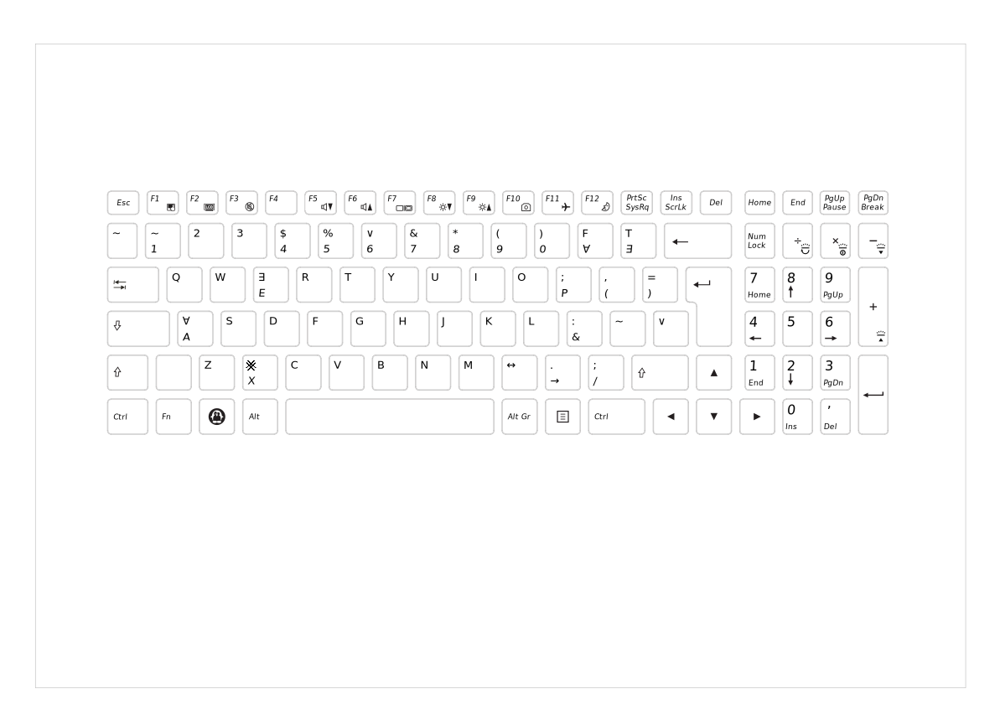

A keyboard layout generated with [klfc](https://github.com/39aldo39/klfc) designed for sentential logic under the Gary Hardegree system. 
# Layout
The layout image was generated using [klf2tux](https://git.42l.fr/neil/klf2tux.git) by neil

